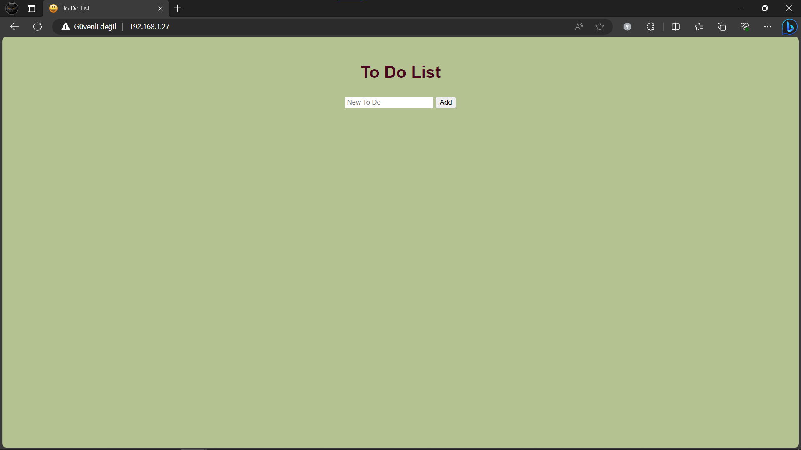
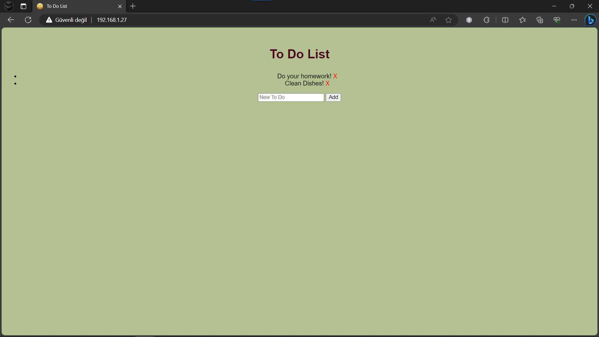

# To-Do List Web App for NodeMCU

![NodeMCU]

This project allows you to create a To-Do List accessible through your local Wi-Fi network. You can add and manage tasks easily through a web interface.

## Usage:

1. Edit the `ino` file and replace the `SSID` and `PASSWORD` fields with your Wi-Fi network name and password.
2. Enter the IP address of the NodeMCU connected to your network in the designated section in the `index.h` file.
3. After completing these steps, you can access the To-Do List through your local IP address.

You can add tasks to the list by typing them into the text box and clicking the "Add" button or pressing the Enter key. This web app is also mobile-friendly.

If you configure port forwarding on your router, you can make the To-Do List accessible to the public.

## Getting Started

Follow these steps to get started with the To-Do List on your NodeMCU:

1. Clone this repository to your computer.
2. Open the `ino` file and update the `SSID` and `PASSWORD` fields with your Wi-Fi network credentials.
3. Upload the sketch to your NodeMCU using the Arduino IDE.
4. Open the `index.h` file and enter the IP address of your NodeMCU.
5. Save the changes and upload the HTML file to your NodeMCU using a tool like [ESP8266FS](https://github.com/esp8266/arduino-esp8266fs-plugin).
6. Power up your NodeMCU and connect it to your Wi-Fi network.
7. Access the To-Do List by entering the NodeMCU's IP address in your web browser.

## Example

Here is an example of how your To-Do List web app might look:

## Public Access

To make the To-Do List accessible to the public, you can set up port forwarding on your router. Be cautious about security when doing this, and consider implementing authentication or other security measures.

## License

This project is licensed under the MIT License - see the [LICENSE.md](LICENSE.md) file for details.

## Acknowledgments

- Special thanks to the NodeMCU community for their contributions.

